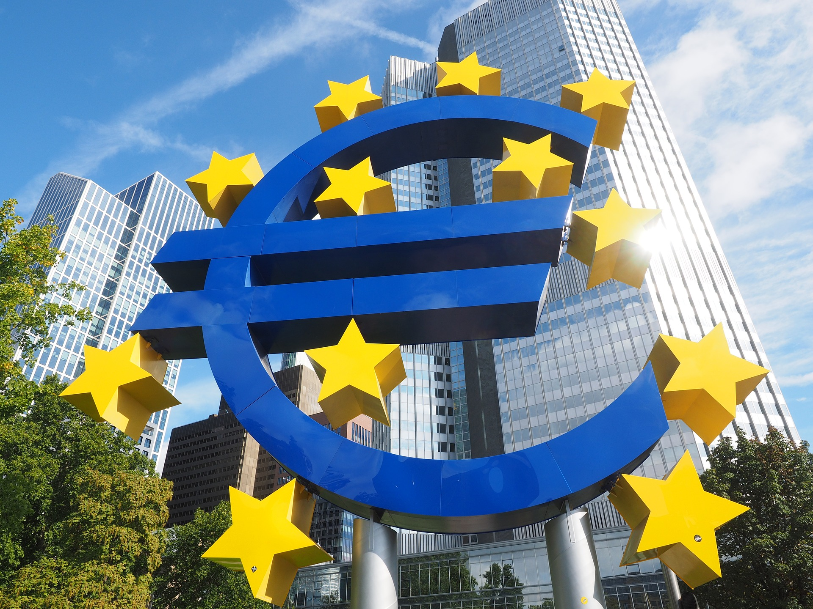

# Printing money is a bad policy

This is yet another reflection after a conversation where my friend said that money printing should be part of the economic measures after a catastrophic scenario (e.g. a climate disaster). He claimed that the alternative solutions where no money is printed wouldn't be enough to stimulate economic growth. I argue that this is not only false, but highly unfair for the present population and very risky toward future generations.

First, I don't see why that would be different from Covid-19, since the important feature is that this is an "agentless disaster", that is, nobody purposefully caused it. But if it helps bringing my point forward somehow, that's fine, let's imagine a tsumani comes and destroys a country of my choosing. Let's suppose that pretty much everything is obliterated by the tsunami. There remain little to no means of production, and only a few stocks of consumable goods, along with whatever savings people have in their accounts.
You say that printing more money would help such scenario. I don't see how brrr would help and I'll detail my view of things could work out.

__Option 1__: *The distribution of new money is done equally among all citizens*  
Goods and services in the country stay the same after the printing. People's cash balance increases equally, so prices would go up just to equalize the purchase power before the printing. Nothing good in terms of purchase power comes out of it. There is an inefficiency though, which is the cost of the money printing, the identification of the receivers, all the bureaucracy and other costs to distribute the money. The only benefited in this scenario are the bureaucrats in the administration that see new money-printing-and-distribution activity. I agree this inefficiency may be too small to be significant, but still, the whole measure is pointless because it has a negative net effect on the creation of wealth. Since any quantity of money (provided it's divisible enough) could suffice for any society to work, the amount of money existing before the money printing would work just as well for the society.

__Option 2__: *The distribution of new money is done unequally among citizens*  
If the new money is not distributed equally, then the measure punishes the savers to favor the ones that receive the new money. This distribution is particularly pernicious because you are not necessarily taking from the rich and giving to the poor. Via inflation, the distribution goes from those who hold cash (savers) to those who receive the new money, whether they are rich or not. It could be even argued that rich people diversify more their wealth so they do not hold as much cash proportionally, hence they would be less affected by this redistribution by having their wealth invested in equity, bonds, real estate, etc. I don't have the data to prove this last thing, but it is a rather plausible possibility.
Even if we agreed that in a catastrophic scenario, wealth redistribution is the only way forward, I fail to see why one would want to take away wealth from the savers. The punishment for being cautious dis-incentivizes any future saving, shaping a society focused on spending. Since long-term projects and innovation are a direct function of available savings, the long-term consequences can be catastrophic in terms of the life-standard not enjoyed by future generations, which should be weighed in too as a cost of any inflationary policy.
I fail to understand what is fair in punishing someone who did the cautious thing plus depriving future generations of a better standard of life.  
In any case, the criteria to distribute the new printed money could be based in different dimensions, but I will focus here only on the typical one of rich-poor:

- New money is given to the richest - This is what usually happens. Since the richest are the most influential and closest to the money printing machines, they are the ones with easier access to credit and hence, to the new money. I don't see why you would want to take money from the savers and give it to the richest, but if History is of any guide, already in the 18th century Richard Cantillon observed how being "close to the money" was beneficial for many of the influential members of society.
- New money is given to the poorest - The poorest receiving this new money see their purchase power increase. Not all of them are benefited equally, however, for if any of the receivers had any savings of their own, they would also see that savings reduce their purchase power. No one in their right mind would want the poorest to remain poor. We all want them to be helped as much as possible and to enjoy the best possible standards of living. However, if the argument for inflation is to help the poor, then it is a bad defense. If the idea is to help the poor, no new money needs to be printed, the government can always reallocate funds from the less essential budget lines to this purpose.

Natural catastrophes, ranging from climate-related ones to pandemics are part of the world we live in. If we want to be consistently moral and fair in our defense of how to improve the economy in such scenarios, the strategy we follow to protect us from the latest disaster must necessarily consider that there will be future ones. Not taking that into account ignores the future victims, which are a direct consequence of our current actions, of building a fragile society based on debt, spending and inflation; these future victims are as worthy of our protection as the current ones but, unluckily for them, they are harder to track and link to the original cause of their disgrace. The case of "let's print money and give it to Mr. X" is easy to defend because there is a visible face that is benefited. The negative consequences are not so visible and hence harder to accept, however these effects not only punish people who decided to be cautious, but also extend a fragile society in time.

There are several measures that would work in favor of stimulating the economy and the creation of wealth, while being fair to the savers and everyone else, and no money printing is needed. From the top of my head:
- Reallocate government spending towards relief programs.
- Have government partially backup business loans.
- Stop taxing or reduce taxes as much as possible.
- Stop or loosen up regulations acting as a barrier to free enterprise and association.

Without going into detail, I believe these measures have a relatively straightforward implementation, but they are not so easy to sell by politicians because they have visible negative effects (e.g. which precise government programs shut down, as opposed to the invisible negative effects of money printing). They would be, however, beneficial both in the short and in the long term, aligning incentives to the creation of value and eventually creating more resilient economies.

To finalize my argument, I would like to point out that many countries live in a perpetual state of disaster. Be it because of endless internal conflicts, highly oppressive and corrupt extractive regimes or whatever reason, if the strategy of money printing works well, shouldn't we see many of those countries exit that situation and prosper? Unfortunately, we don't see that. The reason is that printing money does not equal to creating wealth. In the best case, money printing leaves everyone the same; in the worst case, we find unfair redistribution of wealth and hyperinflation.
