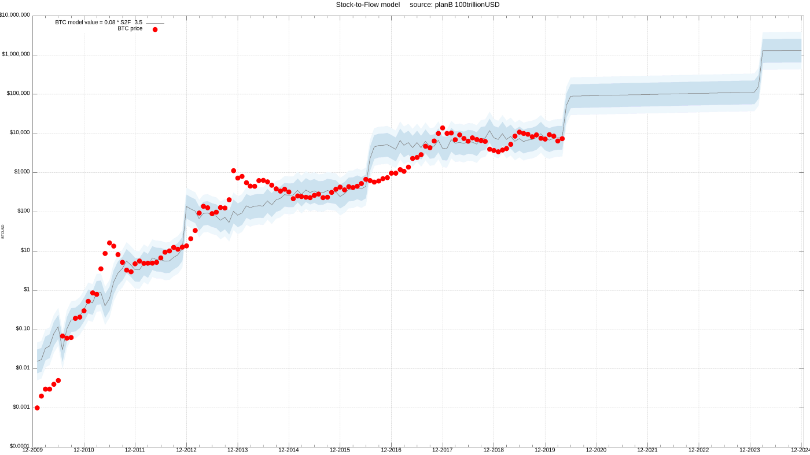
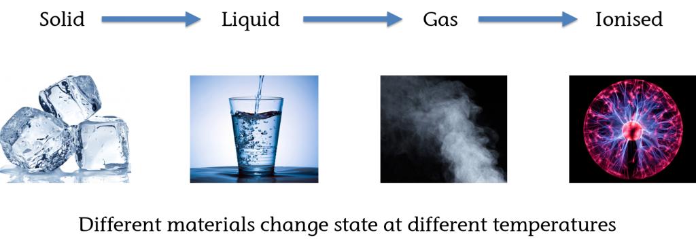
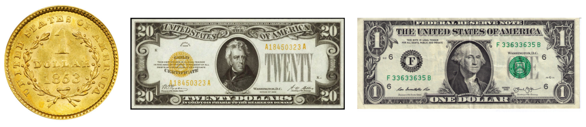
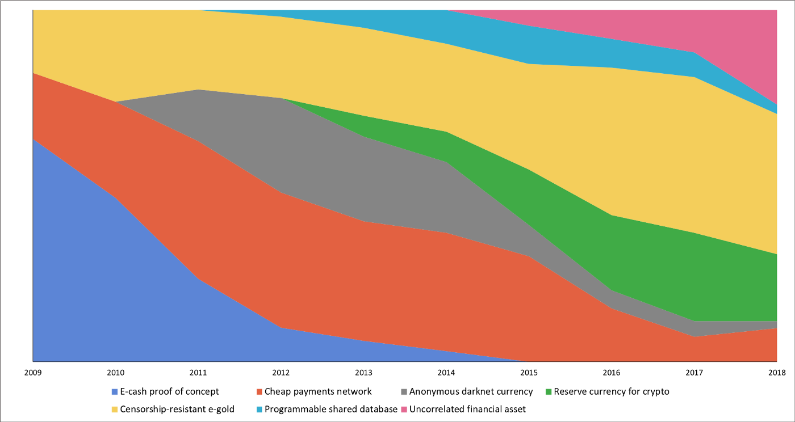
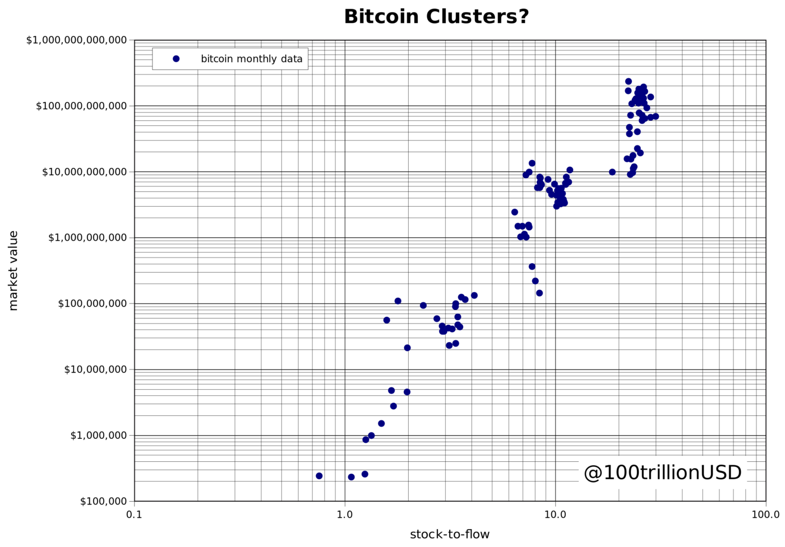
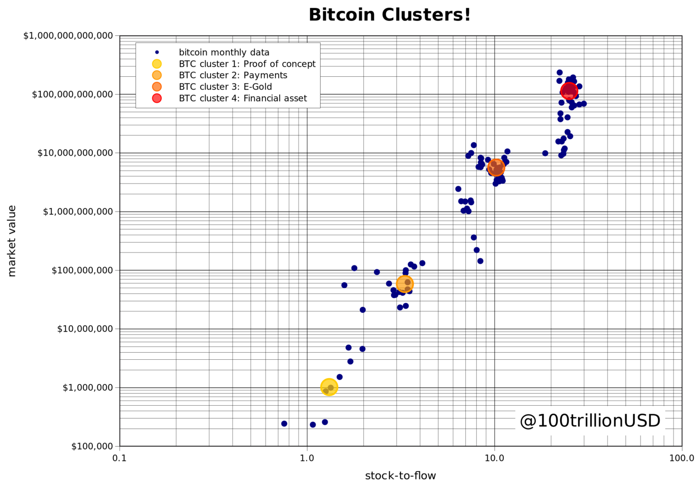
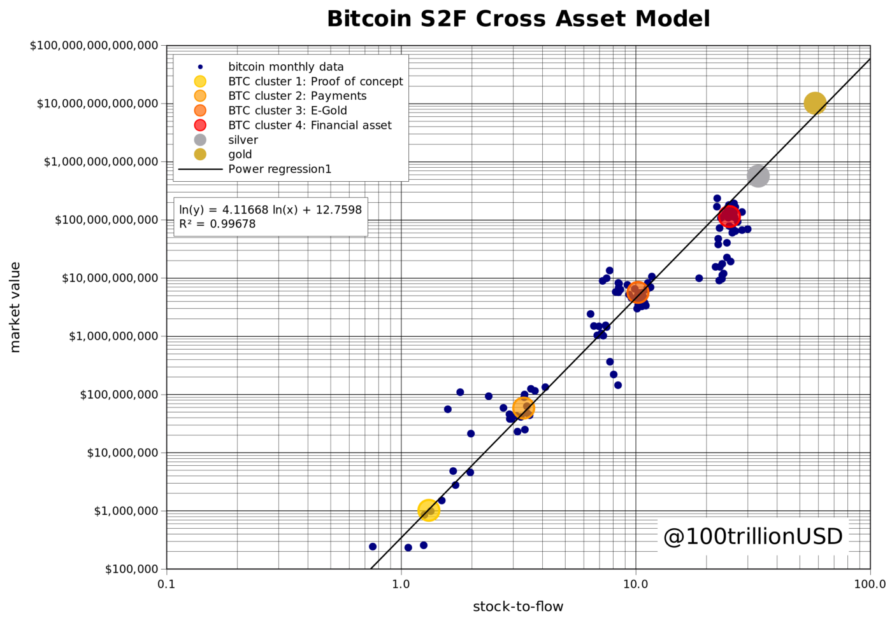
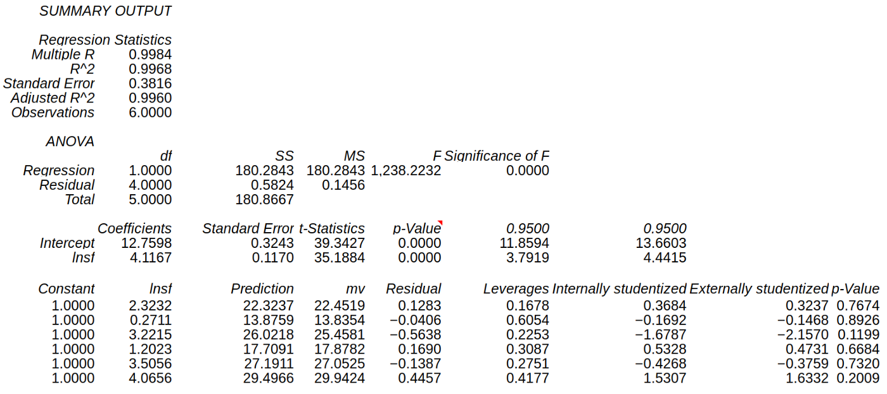

# S2FX: El Modelo S2F de Bitcoin de Activos Cruzados

NOTA: Este artículo es una traducción autorizada del texto original de [PlanB](https://twitter.com/100trillionUSD) - "[Bitcoin Stock-to-Flow Cross Asset Model](https://medium.com/@100trillionUSD/bitcoin-stock-to-flow-cross-asset-model-50d260feed12)"

---

*"Lo importante en ciencia no es tanto obtener nuevos datos como descubrir nuevas maneras de pensar sobre ellos" - William Lawrence Bragg*

## Introducción

El modelo Stock-to-Flow (S2F) de bitcoin (BTC) fue [publicado en Marzo de 2019](https://medium.com/@100trillionUSD/modeling-bitcoins-value-with-scarcity-91fa0fc03e25) [1].

El modelo original BTC S2F es una fórmula basada en el valor de S2F mensual y precio del BTC. Ya que los datos de muestra estaban indexados cronológicamente, es un modelo de serie temporal. Este modelo ha activado a analistas cuantitativos de todo el mundo. Muchos han verificado la relación no espúrea entre S2F y el precio de BTC [2][3][4].

*Modelo S2F actual*

Si no estáis familiarizados con el modelo S2F, recomiendo encarecidamente leer el artículo original, pues ahí se explica el trasfondo y la terminología.

En este artículo cimento la base del modelo S2F actual al quitar el factor tiempo y añadir otros activos (plata y oro) al modelo. A éste, lo llamo S2FX: el modelo S2F de Bitcoin de activos cruzados. S2FX permite la valoración de distintos activos como la plata, el otro y el BTC con una sola fórmula.

Primero, describiré el concepto de transiciones de fase, ya que, introduce un nuevo modo de pensar sobre BTC y S2F. Esto explica porqué el modelo S2FX es importante.

Segundo, describiré el modelo S2FX, cómo funciona y qué significan los resultados.

## Transiciones de fase

Las transiciones de fase dan una perspectiva importante para entender el modelo S2FX. Durante las transiciones de fase, las cosas ganan propiedades totalmente diferentes. Las transiciones son frecuentemente discontinuas. Tres ejemplos de transiciones de fase son:
- Agua
- El dólar (USD)
- BTC

### Agua
El ejemplo clásico de transición de fase es el agua. El agua existe en cuatro fases distintas (estados): sólido, líquido, gas e ionizado. Todos son agua, pero en cada fase el agua tiene propiedades totalmente distintas.

### El dólar (USD)
Las transiciones de fase también están presentes en las finanzas. Por ejemplo, el dólar ha transicionado desde la moneda de oro (1 dólar = 371.25 granos de plata pura = 24 granos de oro), hacia papel respaldado por oro ("Pagable al portador en monedas de oro bajo demanda"), hacia papel no respaldado por nada ("Este billete es moneda legal para todas las deudas públicas y privadas"). Aunque lo sigamos llamando dólar, éste tiene propiedades totalmente diferentes en las tres fases.

### BTC
Lo mismo es cierto para el BTC. Nic Carter y Hasu muestran en su estudio de 2018 cómo las narrativas sobre BTC han cambiado con el tiempo [5].

*[Cómo las mayores narrativas sobre Bitcoin han cambiado con el tiempo](https://medium.com/@nic__carter/visions-of-bitcoin-4b7b7cbcd24c)*

Estas narrativas sobre el BTC parecen bien continuas en la gráfica. Sin embargo, si combinamos las narrativas con los hitos financieros (y luego los datos de S2F y de precio), se tornan bien parecidas a fases con transiciones más abruptas:  

1. "Prueba de concepto" -> Tras el "white paper" de Bitcoin [6]
2. "Pagos" -> tras la paridad con el dólar USD (1BTC = 1USD)
3. "Oro electrónico" -> tras el primer "halving", paridad casi completa con el oro (1BTC = 1 onza de oro)
4. "Activo financiero" -> tras el segundo "halving" (hito de 1000 millones de USD en transacciones diarias, claridad legal en Japón y Australia, mercados de futuros en CME y Bakkt)

Estos tres ejemplos de transiciones de fase en el agua, el dólar USD y el BTC ofrecen una nueva perspectiva para BTC y S2F. Es importante pensar no sólo en términos de series temporales continuas sino también en fases con transiciones abruptas. Al desarrollar el modelo S2FX, veo BTC como un activo distinto en cada fase, con propiedades completamente distintas. El siguiente paso lógico es identificar y cuantificar las transiciones de fase de BTC.

## S2FX: el modelo S2F de BTC de activos cruzados
La siguiente gráfica muestra los valores de S2F y precio mensuales del modelo S2F original. Se pueden idenfificar visualmente cuatro clústeres.

Estos cuatro clústeres podrían indicar transiciones de fase.

La cuantificación de estos clústeres se puede lograr minimizando la distancia entre valores mensuales de BTC y clústeres. Aquí uso un algoritmo genético (minimización de la distancia absoluta) para cuantificar cuatro clústeres. Investigaciones futuras podrían centrarse en distintos algoritmos de agrupación en clústeres (*clustering*) (por ejemplo, el algoritmo *k-means*).

Cada uno de los cuatro clústeres de BTC identificados tiene una combinación distinta de S2F-valor-de-mercado, que parece consistente con los "halvings" y las narrativas cambiantes de BTC.

1. BTC como "Prueba de concepto" (S2F 1.3 y valor de mercado de 1 millón USD)
2. BTC como "Pagos" (S2F 3.3 y valor de mercado de 58 millones USD)
3. BTC como "Oro electrónico" (S2F 10.2 y valor de mercado de 5,600 millones USD)
4. BTC como "Activo financiero" (S2F 25.1 y valor de mercado de 114,000 millones USD)

Al igual que el agua y el dólar USD, estos cuatro clústeres de BTC representan activos diferentes, cada uno con diversas narrativa y características. El BTC como "Prueba de concepto" con S2F 1.3 y sólo 1 millón USD de valor de mercado es un activo totalmente distinto del BTC como "Activo financiero", con S2F 25 y 114,000 millones USD de valor de mercado.

Con la perspectiva de transición de fase donde los clústeres de BTC son activos distintos, puedo añadir otros activos como la plata y el oro al modelo. Esto lo convierte realmente en un modelo de activos cruzados. Para la plata y el oro uso los valores de *stock* y de *flow* del reciente análisis de Jan Nieuwenhuijs [7] y los precios de TradingView de diciembre de 2019.

5. Plata, S2F 33.3 y valor de mercado de 561,000 millones USD
6. Oro, S2F 58.3 y valor de mercado de 10.088 billones USD

Esta gráfica muestra los cuatro clústeres de BTC cuantificados (además del valor mensual de BTC para dar contexto), plata y oro. Se sitúan en una línea perfecta.

Para llegar al modelo S2FX uso análisis de regresión. Nótese que una gran diferencia con el modelo S2F original es que uso los valores de S2F de la plata y el oro en el análisis de regresión. El modelo S2FX muestra una relación significativa entre el valor de S2F y el valor de mercado de estos seis activos (significancia estadística baja, p-valores bajos), con un alineamiento perfecto (99.7% R2).

La fórmula del modelo S2FX se puede usar para estimar el valor de mercado de la siguiente fase/clúster de BTC (el S2F de BTC será 56 en 2020-2024):

Valor de mercado = exp(12.7598) * 56^4.1167 = 5.5 billones de USD

Esto se traduce en un precio por BTC (con un total de 19 millones de BTC en 2020-2024) de 288,000 USD.

La predicción del precio por BTC es significativamente superior a los 55,000 USD del estudio original. Por favor, tengan en cuenta que el modelo S2FX es un primer paso que no ha sido replicado ni revisado por otros.

__Nota 1:__ Aunque seis observaciones es un número bajo, considero relevantes los resultados del modelo S2FX. Esto es por la alta significancia estadística (*F-significance*), los bajos *p-valores* y el alto coeficiente R2, pero también debido a la relación no-espúrea entre S2F y precio, así como de la cointegración en el análisis con series temporales. Investigaciones futuras podrían centrarse en añadir más activos al análisis. Sin embargo, la mayoría de activos tienen valores bajos de S2F (≤1) y por tanto no son interesantes. Por contra, los diamantes tienen un alto S2F, pero una valoración muy compleja (en bruto/tallados, quilates, distintos colores y brillo, etc.).

__Nota 2:__ El modelo S2FX permite la interpolación, en lugar de la extrapolación del modelo S2F original, el cual hace predicciones fuera del rango de datos usados para hacer el modelo. El nuevo modelo S2FX hace una predicción dentro del rango de datos usados para derivar la fórmula.

 and extrapolation (right)")
*Ejemplo de interpolación (izquierda) y extrapolación (derecha) - los datos muestrales en azul, el modelo es la línea negra, el punto rojo es la predicción*

## Conclusión

En este artículo cimento la base del modelo S2F actual quitando el factor tiempo y añadiendo otros activos (plata y oro) al modelo. A ésto lo llamo S2FX: el modelo S2F de Bitcoin de activos cruzados. S2FX permite la valoración de distintos activos como la plata, el oro y el BTC con una sola fórmula.

He explicado el concepto de transición de fase. Las transiciones de fase introducen una nueva manera de pensar sobre BTC y S2F, lo cual me ha llevado al S2FX.

La fórmula del modelo S2FX se ajusta perfectamente a los datos (99.7% R2).

El modelo S2FX estima un valor de mercado en la próxima fase/clúster (el S2F de BTC será 56 en 2020-2024) de $5.5 billones. Esto se traduce en un precio por BTC (con unos 19 millones de BTC en 2020-2024) de $288,000.

Solidificando los hechos conocidos del estudio original sobre S2F, el modelo S2FX ofrece una nueva forma de pensar acerca de BTC transitando hacia la quinta fase.

## Referencias

[1] [PlanB@100trillionUSD](https://twitter.com/100trillionUSD), [Modeling Bitcoin’s Value with Scarcity](https://medium.com/@100trillionUSD/modeling-bitcoins-value-with-scarcity-91fa0fc03e25), Mar 2019

[2] [Nick Emblow](https://twitter.com/btconometrics), [Falsifying Stock-to-Flow As a Model of Bitcoin Value](https://medium.com/swlh/falsifying-stock-to-flow-as-a-model-of-bitcoin-value-b2d9e61f68af), Aug 2019

[3] [Marcel Burger](https://twitter.com/BurgerCryptoAM), [Reviewing “Modelling Bitcoin’s Value with Scarcity”](https://medium.com/burgercrypto-com/reviewing-modelling-bitcoins-value-with-scarcity-part-ii-the-hunt-for-cointegration-66a8dcedd7ef), Sep 2019

[4] [Mannuel Andersch](https://twitter.com/moneymanolis), [Is Bitcoin outshining gold?](https://www.bayernlb.com/internet/media/ir/downloads_1/bayernlb_research/megatrend_publikationen/megatrend_bitcoins2f_20190930_EN.pdf), Sep 2019

[5] [Nic Carter](https://twitter.com/nic__carter), [Hasu@Hasufl](https://twitter.com/hasufl), [Visions of Bitcoin — How major Bitcoin narratives changed over time](https://medium.com/@nic__carter/visions-of-bitcoin-4b7b7cbcd24c), Jul 2018

[6] [https://bitcoin.org/bitcoin.pdf](https://bitcoin.org/bitcoin.pdf) — Satoshi Nakamoto, 2008

[7] [Jan Nieuwenhuijs, How Much Silver Is Above Ground?](https://twitter.com/JanGold_), Dec 2019

## Notas del traductor
*Este artículo es una traducción autorizada del texto original de [PlanB](https://twitter.com/100trillionUSD) - "[Bitcoin Stock-to-Flow Cross Asset Model](https://medium.com/@100trillionUSD/bitcoin-stock-to-flow-cross-asset-model-50d260feed12)"*

En el artículo original, PlanB usa los valores anglosajones del "billón"(*billion* = 10^9) y al "trillón" (*trillion* = 10^12).

Al traducir al español he usado los valores normales que se utilizan en esta lengua (billón = 10^12; no ha sido necesario usar la palabra "trillón").

